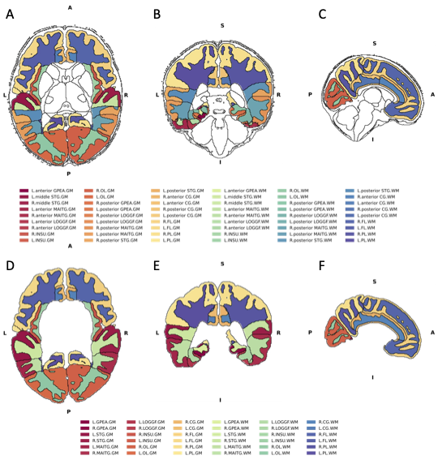
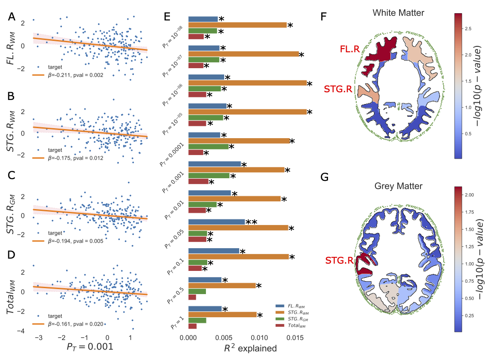

# NIMAGEN: Statistical and Visualisation tool for NeuroIMAging GENetics studies

See the online documentation

## Quick install

1. `pip install lehai-ml/nimagen`
2. `conda install -c lehai-ml nimagen`

Main functions of ```nimagen``` is to 
1. Perform mass linear regression tests and subsequent stability tests.
2. Visualise significant results and plot them on brain maps
3. Visualse gene-set based analyses results

Example of a plot created with ```nimagen```



Figure 1. Example map of brain regions with accompanying legend


Figure 2. Example regression multiple-plot

Version update
- 0.0.2 - 20 March 2023 - Revamped stats module to use patsy format instead.
- 0.0.1 - First version
