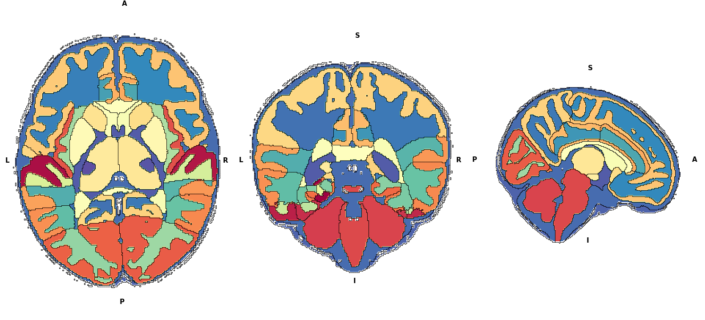
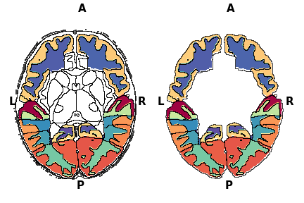
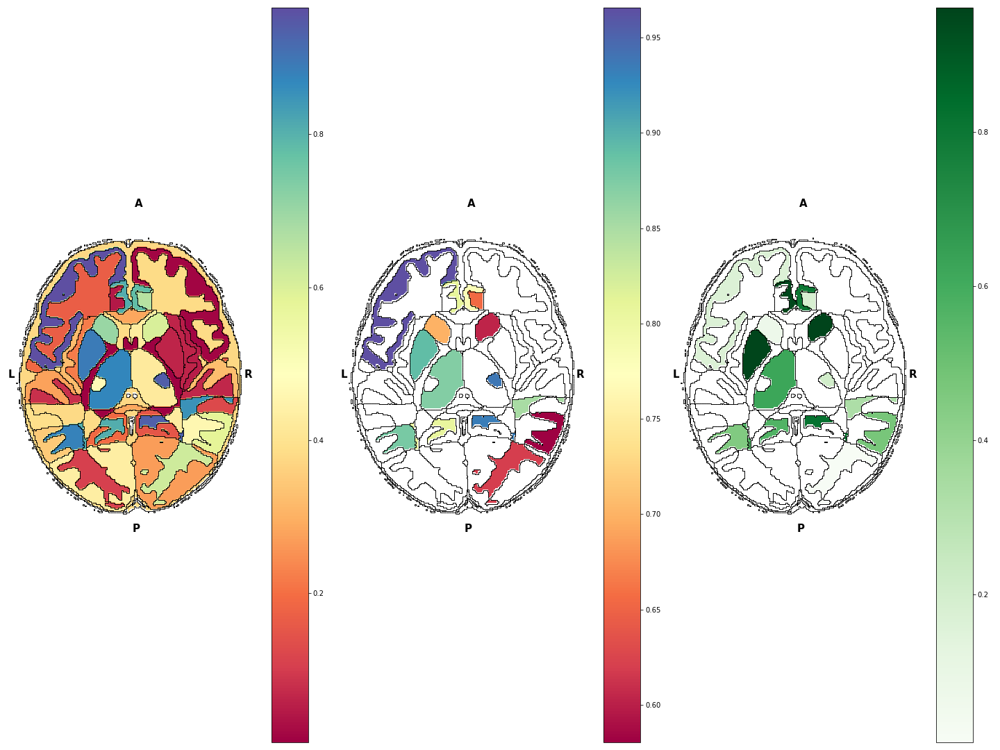
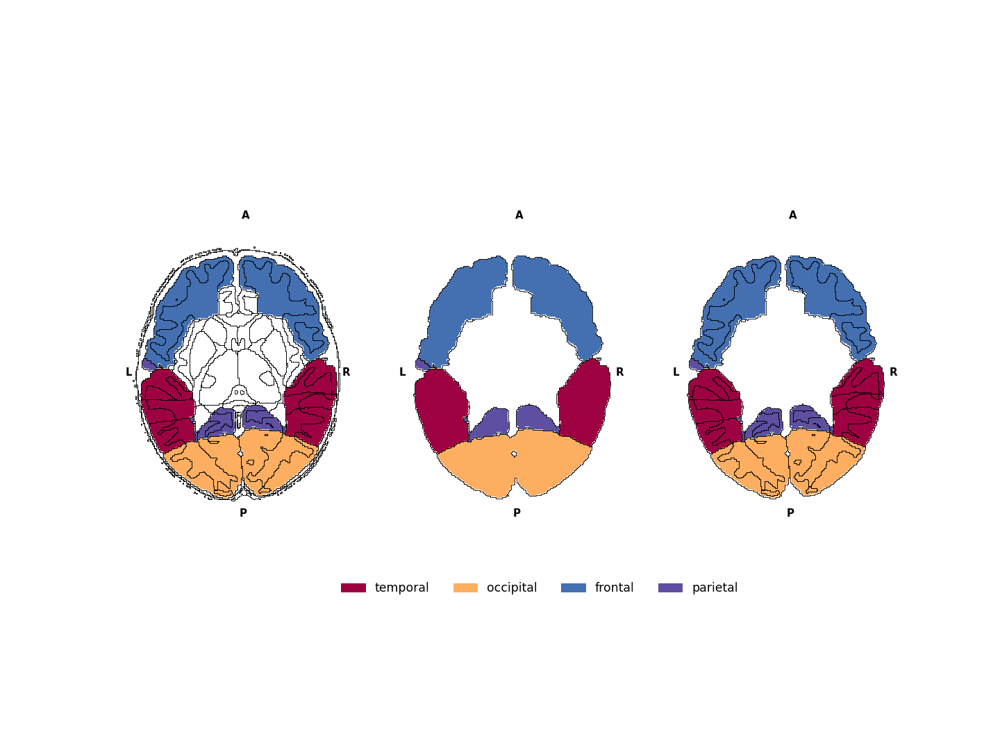
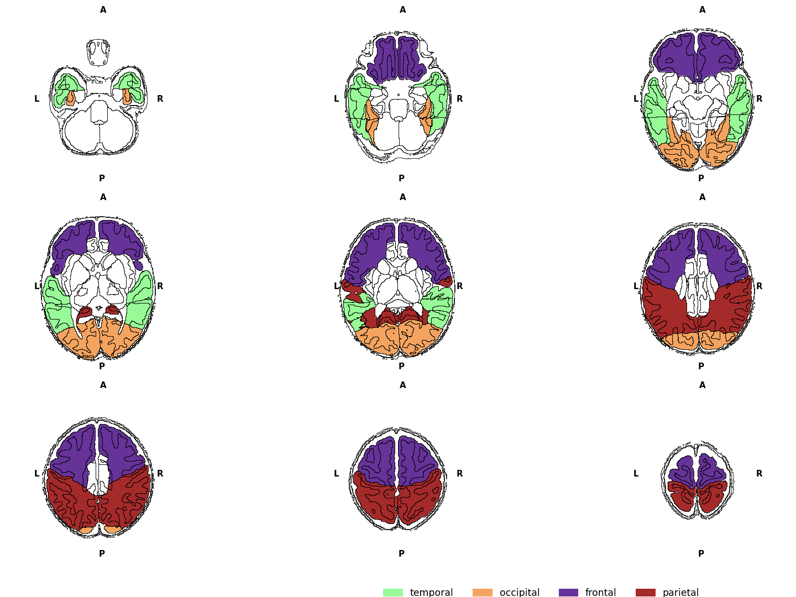
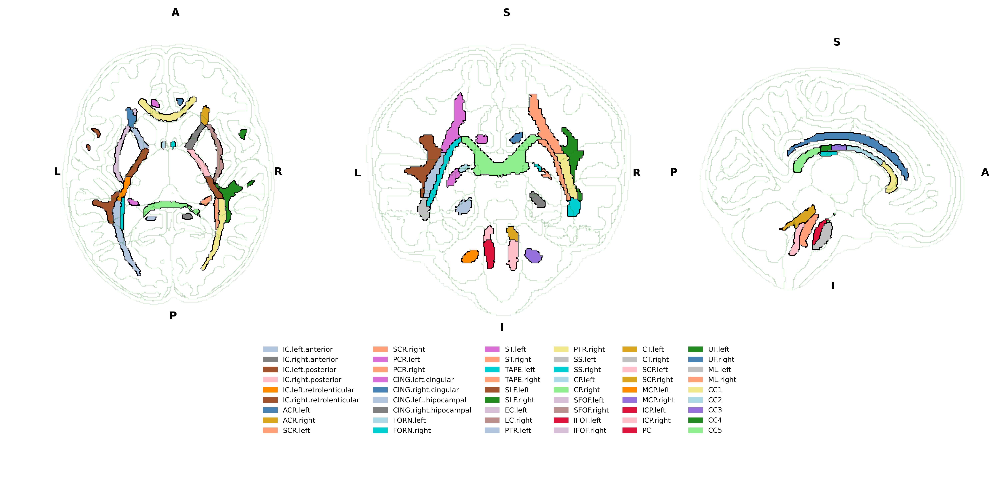
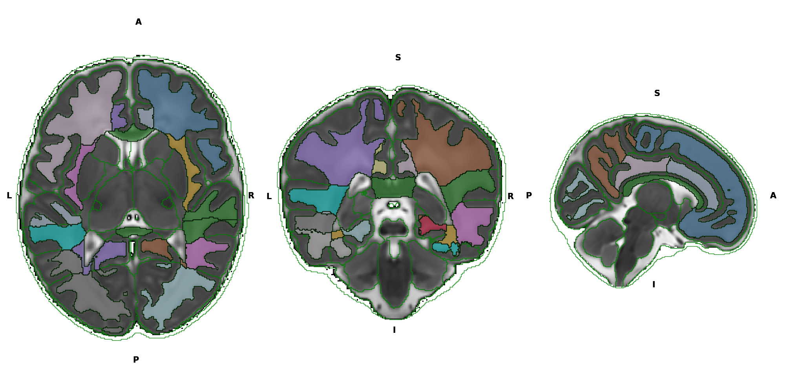
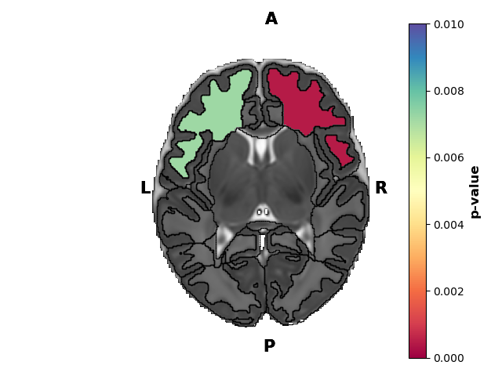

Visualisation tools
===================

The following plots can be created:

Brain maps
^^^^^^^^^^

.. _initialise_brain_map:

Basics commands
---------------
The ``visualisation.Brainmap`` function requires ``nibabel`` to read NifTi files. The Nifti file in question must be a segmentation file, where each value corresponds to a label. One can visualise this file like so::

    visualisation.Brainmap.plot_segmentation(atlas_file='/path/to/nifti')

Here is an example output

The working of this is simple. First, the nifti file values are read into two identical numpy arrays. From here, one of the numpy array is used to "colour", and one to plot outlines. So if in your nifti file, value 1 corresponds to hippocampus, then a black outline will trace along the edges of that hippocampus. This outline process is repeated for each structure. The structures are differentiated by having different values in the array. This allows us to do the following things:

*Hide regions*

.. _regions_to_hide:

.. code-block:: python

    visualisation.Brainmap.plot_segmentation(atlas_file='/path/to/nii.gz',
                                             regions_to_hide=[i for i in lobe_only.keys()])

Here, the values in regions passed to ``regions_to_hide`` is set to NA. So the function knows not to colour them. You can also hide the outlines of the NA regions by setting ``outline_regions_to_hide`` to ``False``.

*Plot values and mask regions based on threshold*

Suppose you have done some statistics, and now you wnat to colour the regions based on that values. To do this you need to pass in the ``plot_values`` argument. It is a dictionary, where the dictionary keys are the region interger value, and dictionary values is the plot value. If the key is not present in the ``plot_values`` dictionary, then the plot value is set to NA, i.e. it is not plotted.

.. code-block:: python

    plot_val = {k:p for k,p in zip(range(1,88),np.random.random(87))}
    # dictionary, where keys are the segmentation label, and values are the 
    # values to plot
    mask = {k:p for k,p in zip(range(1,88),np.random.random(87))}
    fig,axes = plt.subplots(1,3,figsize=(20,15))
    _,_ = visualisation.Brainmap.plot_segmentation(
        atlas_file='/path/to/nii.gz',
        map_view=['axial'],
        plot_values=plot_val,axes=axes[0],colorbar=True,fig=fig)

    _,_ = visualisation.Brainmap.plot_segmentation(
        atlas_file='/path/to/nii.gz',
        map_view=['axial'],
        plot_values=plot_val,
        plot_values_threshold=0.50,
        axes=axes[1],colorbar=True,fig=fig)

    _,_ = visualisation.Brainmap.plot_segmentation(
        atlas_file='/path/to/nii.gz',
        map_view=['axial'],
        plot_values=plot_val,
        plot_values_threshold=0.50,
        mask=mask,
        axes=axes[2],colorbar=True,fig=fig,cmap='Greens')

*Plot label legends*

The ``label_legend`` is also a dictionary in the same format as ``plot_values``, where the dictionary key is the segmentation label, and the dictionary value is the string label. By default regions that have the same string label, only the boundary of the group is drawn, and the regions that do not have keys in the legend dictionary are not outlined. To turn off this option, set ``outline_label_legends`` to ``False``. By default, the legend will be created based on the unique values in the ``label_legend``, where each value will be given a colour. The legend box position and fontsize can be controlled (use at your own perils). Use combinations of ``regions_to_hide`` and ``label_legend`` to create different plots.

.. code-block:: python
    
    fig,axes = plt.subplots(1,3,figsize=(20,15))
    _,_ = visualisation.Brainmap.plot_segmentation(
        atlas_file='/path/to/nii.gz',
        map_view=['axial'],
        label_legend=lobe_only_legend,
        outline_label_legends=False,axes=axes[0],fig=fig,label_legend_bbox_to_anchor=(-1.5,-0.25,0,0),label_legend_fontsize='xx-large')

    _,_ = visualisation.Brainmap.plot_segmentation(
        atlas_file='/path/to/nii.gz',
        map_view=['axial'],
        label_legend=lobe_only_legend,axes=axes[1],fig=fig,legends=False)

    _,_ = visualisation.Brainmap.plot_segmentation(
        atlas_file='/path/to/nii.gz',
        map_view=['axial'],
        regions_to_hide=remove_regions,
        label_legend=lobe_only_legend,
        outline_label_legends=False,
        outline_regions_to_hide=False,axes=axes[2],fig=fig,legends=False)

Additional options
------------------

*Changing view slice and orientation*

You can select multiple views by setting ``map_view`` option or ``atlas_slice``. By default, the function will view the middle slice in all 3 orientations (axial, coronal and sagittal). The slice visualise across any direction can be customised.

.. note::
    The plot can only be plotted if the slice contains non-NA values in the numpy array. For example, even if the axial view has shape 200,274. It may not plot slices from 0 to 20 if the numpy array has only NA values.

.. code-block:: python

    atlas_slices = [int(i) for i in np.linspace(50,180,9)]
    fig,axes = plt.subplots(3,3,figsize=(20,15))
    axes = axes.flatten()
    for ax,atlas_slice in zip(axes,atlas_slices):
        if atlas_slice == 115:
                _,_ = visualisation.Brainmap.plot_segmentation(
                atlas_file='/path/to/nii.gz',
                map_view=['axial'],
                atlas_slice = atlas_slice,
                label_legend=lobe_only_legend,
                outline_label_legends=False,
                axes=ax,fig=fig,
                legends=True,
                label_legend_bbox_to_anchor=(-2.0,-0.25,0,0),
                label_legend_fontsize='xx-large')
        else:
            _,_ = visualisation.Brainmap.plot_segmentation(
                atlas_file='/path/to/nii.gz',
                map_view=['axial'],
                label_legend=lobe_only_legend,
                outline_label_legends=False,
                atlas_slice = atlas_slice,
                axes=ax,
                legends=False)

    plt.tight_layout()

*Overlaying second atlas*

You can do this if you pass the same axes argument to the next ``Brainmap.plot_segmentation`` using another ``atlas_file``.

.. note::
    You can change the transparency or colour of the outline of the first plot to make it less visible by defining ``outline_colour`` and ``outline_alpha`` arguments.

.. code-block:: python

    fig = plt.figure(figsize=(20,10))
    gs = fig.add_gridspec(3,3)
    axes1 = fig.add_subplot(gs[0:2, 0])
    axes2 = fig.add_subplot(gs[0:2, 1])
    axes3 = fig.add_subplot(gs[0:2, 2])
    axes4 = fig.add_subplot(gs[2, :])
    axes4.set_axis_off()
    _,_ = visualisation.Brainmap.plot_segmentation(
        atlas_file='../dataset/visualise/wm_parcellation/parcellation_maps_05mm/reference-05mm-dHCP-structure-parcellation.nii.gz',
        regions_to_hide=[i for i in range(88)],
        outline_alpha=0.1,
        outline_colour='green',
        axes=[axes1,axes2,axes3])
    _,_ = visualisation.Brainmap.plot_segmentation(
        atlas_file='../dataset/visualise/wm_parcellation/parcellation_maps_05mm/reference-05mm-WM-parcellation.nii.gz',
        label_legend=wm_parcellations,
        cmap='tab20',
        axes=[axes1,axes2,axes3],
        legends=True,
        label_legend_axis=axes4,
        label_legend_loc='upper center',label_legend_bbox_to_anchor=None,label_legend_ncol=6)
    plt.tight_layout()

.. note::
    In case that your label legend is too big, and plt.tight_layout does not work properly (e.g, when you save figure, your figure is cut off). You can do the following. Define a series of smaller subplots. Group the subplots as shown in the code above. And add the label legend onto its own separate axis. Finally, you can change the ``figsize`` to get your desired plot.

*Overlaying on a non-parcellation image (e.g. T2)*

Suppose you want to overlay your parcellation on your T2 image. You can do so in a similar way to the example above.

.. code-block:: python

    fig = plt.figure(figsize=(18,25))
    gs = fig.add_gridspec(1,3)
    axes1 = fig.add_subplot(gs[0:2, 0])
    axes2 = fig.add_subplot(gs[0:2, 1])
    axes3 = fig.add_subplot(gs[0:2, 2])
    
    _,_ = visualisation.Brainmap.plot_segmentation(
        atlas_file='../../dataset/visualise/wm_parcellation/parcellation_maps_05mm/reference-05mm-mean-T2.nii.gz',
        axes=[axes1,axes2,axes3],cmap='gray',T2=True,background_value=1)
    
    _,_ = visualisation.Brainmap.plot_segmentation(
        atlas_file='../../dataset/visualise/wm_parcellation/parcellation_maps_05mm/reference-05mm-dHCP-structure-parcellation.nii.gz',
        regions_to_hide=[i for i in range(88)],
        outline_alpha=1,
        outline_colour='green',
        axes=[axes1,axes2,axes3])
    _,test = visualisation.Brainmap.plot_segmentation(
        atlas_file='../../dataset/visualise/wm_parcellation/parcellation_maps_05mm/reference-05mm-dHCP-structure-parcellation.nii.gz',
        regions_to_hide={k:v for k,v in full_legend.items() if 'WM' not in v},
        label_legend=full_legend,
        cmap='tab20',
        axes=[axes1,axes2,axes3],
        image_alpha=.5,
        legends=False)

Here, we set our first image as the T2 (this works for anything like FA map, T1 etc.). Notice that we have to set ``T2=True``. In this particular case, the T2 image has some weird values in the background, where it is not exactly 0. So option ``background_value=1`` is defined to set any values in the T2 image below 1 to np.nan (i.e., transparent). The second image is a green outline of the parcellation map. The third image is the labels of the region of interest, where only the WM label is shown. The ``image_alpha`` option defines the overall alpha channel of the overlay image.

You can combine several plots by overlaying on each other to get your desired final plot. For example, suppose you want to 1) visualise statistics (e.g., p-value) of several regions, that 2) have been grouped so the outline is different from the original parcellation file (e.g., region 1 and 2 has been grouped but you don't want to have outline of each region separately, but rather together) and 3) plotted on the T2.

.. code-block:: python

	fig,ax = plt.subplots(1,1)
	# atlas_slice=[150,150,150]
	atlas_slice=108
	map_view=['axial']
	_,_ = visualisation.Brainmap.plot_segmentation(
	    map_view=map_view,
	    atlas_file=T2_file,
	    atlas_slice=atlas_slice,
	    axes=[ax],cmap='gray',T2=True,background_value=1)
	_,_ = visualisation.Brainmap.plot_segmentation(
	    map_view=map_view,
	    label_legend=to_plot_new,
	    atlas_file=drawem_parcellation,
	    image_alpha=0,
	    outline_alpha=1,
	    outline_colour='k',
	    axes=[ax],legends=False)
	_,_ = visualisation.Brainmap.plot_segmentation(
	    map_view=map_view,
	    atlas_slice=atlas_slice,
	    plot_values=to_plot_new,
	    atlas_file=drawem_parcellation,
	    plot_values_threshold=.01,
	    cb_threshold_greater=False,
	    cb_vmin=0,
	    cb_vmax=0.01,
	    outline_alpha=0,
	    axes=[ax],fig=fig,colorbar=True,cb_title='p-value',cb_orientation='vertical')
	    
Here, you can plot the T2 image first as the background. Then you plot the segmentation of your interest, here the ``to_plot_new`` is a dictionary, where key is the label corresponding to the parcellation map, and value is a p-value score. Suppose region 1 and 2 are to be grouped, then the value (i.e., p-value) must be the same for key 1 and key 2 in the ``to_plot_new``. In the second plot, you suppress the colouring of the label legends by using option ``image_alpha=0``, so that only the outline is plotted, and the ``legends=False``. In the third plot, you viusalise the ``to_plot_new``, but now you suppress the ``outline_alpha``, because by default it will outline the parcellation map. 

